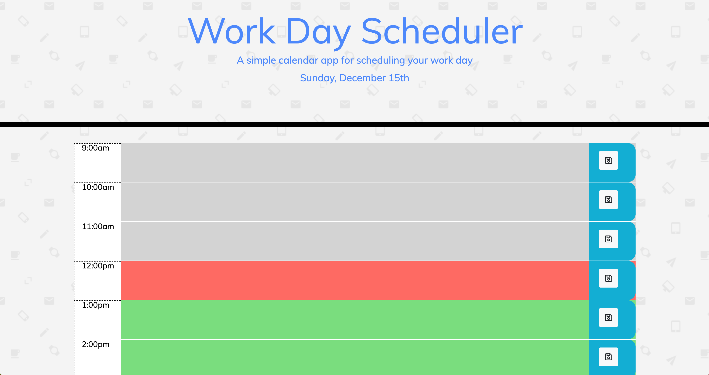

# Day_Planner

This is a simple day planner that will allow you to schedule your work day between the hours of 9:00 am and 5:00 pm. To aid in visualization- the planner is designed to display in color blocks according to past, current and future times. Once your activities are logged and saved, they will remain on browser refresh as well as exiting the browser completely. This feature will allow you to exit the planner and then go back to it at anytime, knowing that your information will be there when you need it. Happy planning!

Click on the link and head to the deployed site.

<a href= "https://sjervin07.github.io/Day_Planner/"

